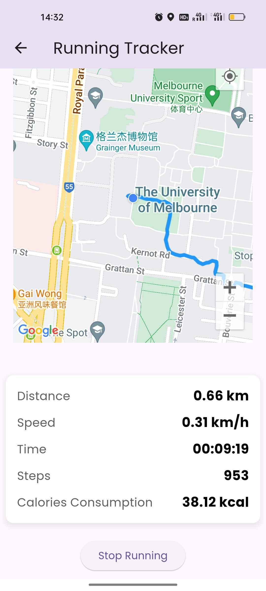
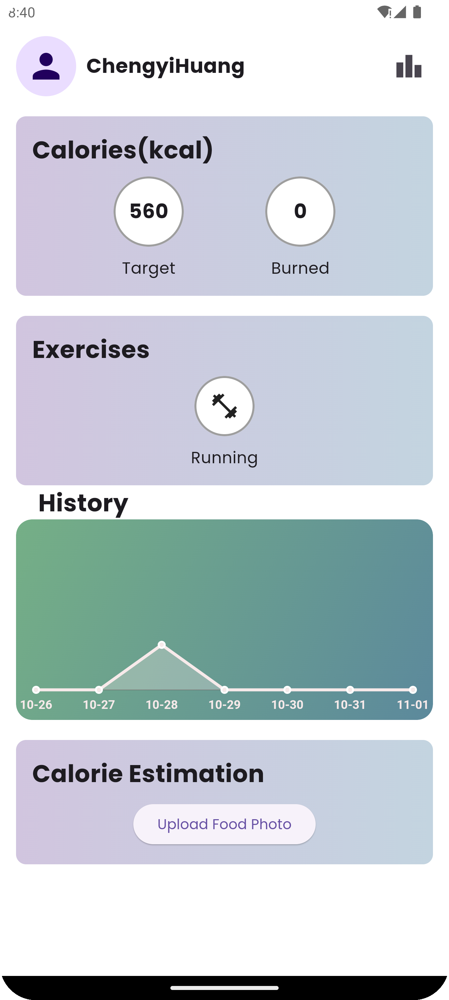
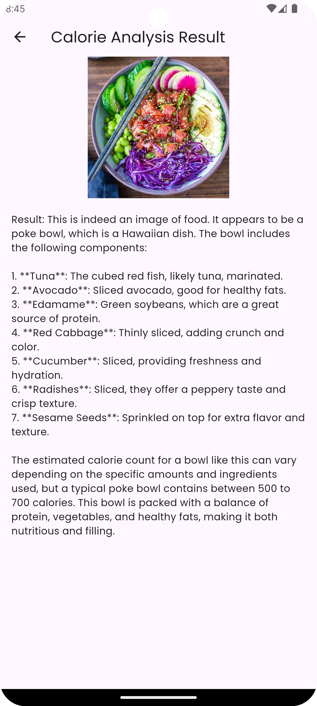
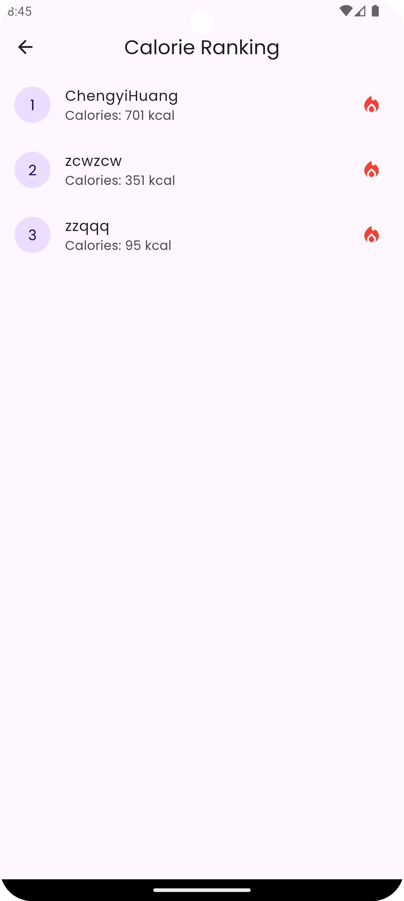

c# Fitness Tracker App 🏃📍🍏📱

The **Fitness Tracker App** is a comprehensive solution for tracking your runs, monitoring calorie burn, and setting fitness goals. With integrated real-time route mapping and AI-powered calorie estimation for food tracking, this app is designed for users who want a streamlined, all-in-one fitness experience.

## Table of Contents
- [Project Overview](#project-overview)
- [Key Functionalities](#key-functionalities)
- [Getting Started](#getting-started)
- [Tech Stack](#tech-stack)
- [Screenshots](#screenshots)
- [Future Enhancements](#future-enhancements)
- [Contact](#contact)

## Project Overview

The **Fitness Tracker App** is a Flutter-based application focused on run tracking and calorie management. Whether you’re mapping out a new running route or aiming for a specific daily calorie goal, this app offers the tools to support your journey. The running tracker utilizes Google Maps for real-time tracking, while the calorie estimation feature lets users take food photos and get instant calorie estimates—without any manual entry.

## Key Functionalities

### 1. Running Tracker with Google Maps Integration 🌍
- **Real-time Route Mapping**: Track your running route on Google Maps with live updates as you move.
- **Distance & Speed Tracking**: View real-time stats, including distance covered, speed, and average pace.
- **Calories Burned**: Estimate calories burned based on steps and distance, and store historical data for progress tracking.

  

### 2. Step Counter & Calorie Management 🏆
- **Automatic Step Counting**: Tracks steps in real-time, calculating total calories burned based on activity.
- **Daily & Weekly Summaries**: Access summaries to view calorie burn and step counts over time.

  

### 3. Image-Based Calorie Estimation 📸
- **AI-Powered Food Recognition**: Take or upload a photo of your food, and the app estimates calorie content using OpenAI’s GPT-4 Vision API.
- **Quick & Easy**: No need for manual input, making calorie tracking simpler and faster.

  

### 4. Leaderboard 🏅
- **Top Calorie Burners**: Compete with other users through a weekly leaderboard, showcasing top achievers based on calorie burn.
- **Motivation Boost**: Get motivated to stay active and reach the top of the leaderboard.

  

## Getting Started

### Prerequisites
- **Flutter**: Ensure Flutter is installed.
- **Firebase**: Set up a Firebase project for user authentication and Firestore.

### Installation Steps

1. **Clone the Repository:**

   ```bash
   git clone https://github.com/your-repo/fitness-tracker.git
   cd fitness-tracker
   ```

2. **Install Dependencies:**

   ```bash
   flutter pub get
   ```

3. **Configure Firebase:**
   - Set up Firebase Authentication and Firestore for backend services.
   - Download `google-services.json` from Firebase and place it in the `android/app` directory.

4. **Add Google Maps API Key:**
   - Obtain an API key from Google Cloud Platform and add it to `AndroidManifest.xml`.

5. **Set Up OpenAI API Key for Calorie Estimation:**
   - Obtain an API key from OpenAI and replace `YOUR_OPENAI_API_KEY` in `photo_result_view.dart`.

6. **Run the App:**

   ```bash
   flutter run
   ```

## Tech Stack
- **Frontend**: Flutter (Dart)
- **Backend**: Firebase (Firestore, Authentication)
- **Mapping & Location Tracking**: Google Maps SDK, Geolocator
- **AI Integration**: OpenAI GPT-4 Vision API for image-based calorie estimation

## Screenshots
- **Home Screen**: Quick access to calories burned, step count, and weekly summary.
- **Running Tracker**: Real-time route tracking, pace calculation, and calorie tracking on a Google Map.
- **Food Calorie Estimation**: Instantly estimate calories from food images using AI.
- **Leaderboard**: Weekly ranking based on calories burned to motivate users.

## Future Enhancements
- **Support for Additional Activities**: Extend tracking features to support cycling, swimming, and more.
- **Enhanced AI Food Recognition**: Improve accuracy of calorie estimates through advanced AI models.
- **Push Notifications**: Daily reminders for staying active and achieving calorie goals.
- **Social Sharing**: Allow users to share achievements and running routes with friends.

## Credit
Chengyi Huang, Ren Ding, Qingling Zhao, Ren Ding, Leiya Chen
